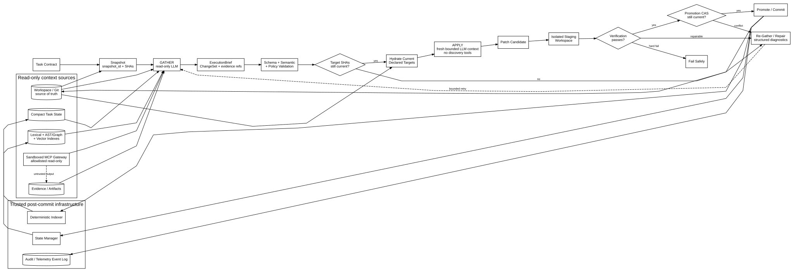

# Forge — Local Agent IDE

Forge is a native Windows coding-assistant IDE for local/open-weight models. It implements the two-phase architecture in `senior_ai_architecture_review.md`: an ephemeral read-only **Gather** phase creates a validated `ExecutionBrief`, then a fresh bounded **Apply** phase may generate mutations only for the declared files.



## What is implemented

- Electron + React + Monaco Windows IDE with native folder selection, multi-tab editing, frameless window controls, save conflict detection, local-model settings, and a live agent event timeline.
- Local adapters for **Ollama**, **LM Studio**, and **llama.cpp**. The API accepts loopback endpoints only.
- Automatic runtime discovery on ports `11434`, `1234`, and `8080`; Forge selects a model that is actually available instead of assuming a model name.
- Repository snapshot and per-file SHA-256 preconditions.
- Bounded lexical/structural-context retrieval with focused evidence regions.
- Strict `ExecutionBrief` and mutation-set validation with one correction attempt.
- Just-in-time target hydration; Apply has no search, MCP, shell, or general read capability.
- Copy-on-write staging in a temporary workspace, trusted project checks, final CAS, promotion, rollback on promotion errors, and an audit log at `.forge/audit.jsonl`.
- One bounded Gather repair cycle when deterministic verification fails.
- High-risk plans stop for human review. `discussion` directories are excluded from browsing, retrieval, staging, and mutation.

## Code-OSS Windows application

Forge now runs as a built-in Code-OSS workbench extension. This preserves the
existing Gather/Apply agent loop as an authenticated loopback worker while
adding the full editor workbench, integrated terminal, debugger, SCM, language
services, keybindings, and the native Extensions view.

The Forge Agent chat opens automatically in the Secondary Side Bar. It contains
runtime and model selection, a task composer, and the live Gather/Apply event
timeline. Use **Forge: Open Agent Chat** from the Command Palette if the view is
closed. Model discovery remains available in Restricted Mode; autonomous
repository operations require the open folder to be trusted.

Create or refresh the workspace-contained Windows runtime, then launch it:

```powershell
npm run code-oss:runtime
npm run code-oss:run
```

The runtime is a SHA-256-verified official VSCodium release (a Code-OSS
distribution) patched with Forge branding and the built-in Forge extension. It
is not installed system-wide. User data and extensions live under `.forge/`, so
existing Visual Studio Code, VSCodium, and Forge profiles are not changed.

Open VSX is configured as the extension gallery. You can also use **Extensions:
Install from VSIX...** from the Command Palette or Extensions view. The
standalone Forge extension is produced at `release/forge-agent-0.4.1.vsix`.

To build directly from Microsoft's official Code-OSS source instead, install
the Windows C++ build workload including the latest x64/x86 Spectre-mitigated
libraries, then run:

```powershell
npm run code-oss:bootstrap
npm run code-oss:run
```

The bootstrap uses the shallow checkout at `vendor/code-oss`, applies
`code-oss/product-overrides.json`, and copies Forge into Code-OSS's built-in
`extensions/` directory. `npm run code-oss:sync` reapplies Forge after an
upstream update.

To create a distributable portable ZIP:

```powershell
npm run code-oss:package
npm run code-oss:installer
```

## Legacy Electron prototype

The original custom Electron/Monaco shell is retained only for reference. Its
Search, Source Control, Run/Debug, Extensions, and command-center controls were
visual placeholders. Use the Code-OSS installer or portable ZIP for a complete
workbench.

The two prototype distributables are archived in `release/legacy-electron/` so
they cannot be confused with the Code-OSS installer:

- `Forge-Local-Agent-IDE-Setup-0.1.0-x64.exe` — legacy prototype installer.
- `Forge-Local-Agent-IDE-Portable-0.1.0-x64.exe` — legacy prototype portable application.

On first launch Forge opens your Documents folder. Use the folder button beside the workspace name to choose a code repository; the last workspace is remembered.

Forge scans all supported local runtimes at startup. Ollama's service normally starts with the Ollama app. For LM Studio or a llama.cpp-compatible app, make sure its local API server is running. Open Forge Settings to see live status dots, discovered model counts, and the exact model picker.

## Run from source

Requirements: Node.js 20+ and one local inference server.

```bash
npm install
npm run code-oss:runtime
npm run desktop
```

To rebuild the Forge extension, integrate it into the local Code-OSS runtime,
and launch the workbench:

```bash
npm run desktop:dev
```

The legacy React prototype remains available with `npm run legacy:desktop:dev`.
Its browser-hosted version uses `npm run dev` at
[http://127.0.0.1:5173](http://127.0.0.1:5173).

Default provider endpoints:

| Provider | Endpoint | API |
| --- | --- | --- |
| Ollama | `http://127.0.0.1:11434` | `/api/chat`, `/api/tags` |
| LM Studio | `http://127.0.0.1:1234` | OpenAI-compatible `/v1` |
| llama.cpp | `http://127.0.0.1:8080` | OpenAI-compatible `/v1` |

Use the gear button in Forge to choose among the automatically detected providers and models or retry a custom loopback endpoint.

To make Forge operate on another repository, start the API with an explicit workspace root:

```powershell
$env:WORKSPACE_ROOT = "C:\path\to\project"
npm run dev
```

## Verification

```bash
npm run typecheck
npm test
npm run test:code-oss
npm run build
npm run extension:package
npm run dist:win
```

In a staged candidate workspace, Forge runs recognized trusted scripts in this order when present: `typecheck`, `lint`, `test`, and `build`. Commands suggested by a model are recorded in the brief but are never executed automatically.

## Safety model

```text
task → snapshot → Gather/retrieve → validate brief → target CAS/hydration
     → fresh Apply → validate write set → isolated stage → deterministic checks
     → promotion CAS → atomic file writes → audit
```

The source workspace remains untouched when a model response is invalid, a preimage is stale, a mutation escapes its declared write set, or staged verification fails. External MCP mutation is intentionally not part of this P0 implementation.
