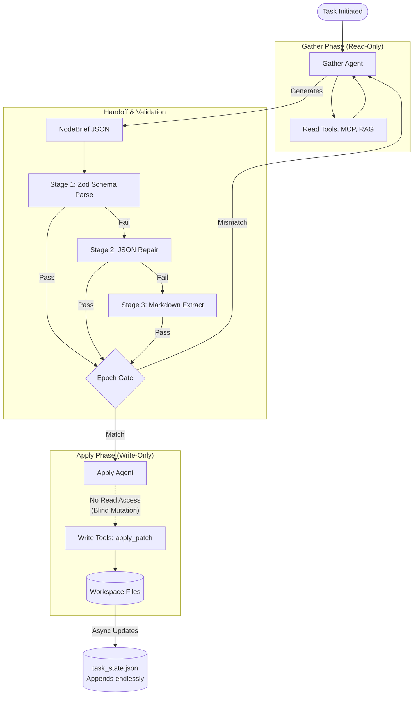

# Architecture Data Flow Comparison

This document visualizes the differences between the **Original Two-Phase Loop** (from the initial blueprints) and the **Recommended Hardened Loop** (which incorporates the critical fixes from the architectural review).

## 1. Original Two-Phase Loop (Flawed)

The original architecture correctly decoupled research and execution, but it suffered from "blind mutations" in the Apply phase, lacked a rollback mechanism, and was susceptible to race conditions and hallucinated plans.



## 2. Recommended Hardened Loop

The recommended architecture resolves the critical flaws by introducing **Epoch Locking**, a **Semantic Validation Stage**, **Scoped Reads** for the Apply phase, and a **Mutation Journal** for atomic rollbacks.

```mermaid
flowchart TD
    classDef newFeature fill:#0f5228,stroke:#1e9e4d,stroke-width:2px,color:#fff;
    
    Start([Task Initiated]) --> EpochLock
    EpochLock[Acquire Epoch Lock]:::newFeature --> Gather
    
    subgraph GatherPhase ["Gather Phase (Read-Only)"]
        Gather[Gather Agent] --> ReadTools[Read Tools, MCP, RAG]
        ReadTools --> RAGFeedback[RAG Quality Tracker]:::newFeature
        RAGFeedback --> Gather
    end
    
    Gather -- Generates --> NodeBrief[NodeBrief JSON]
    
    subgraph Handoff ["Handoff & Validation"]
        NodeBrief --> Stage1[Stage 1: Zod Schema Parse]
        Stage1 -- Fail --> Stage2[Stage 2: JSON Repair]
        Stage2 -- Fail --> Stage3[Stage 3: Markdown Extract]
        Stage1 & Stage2 & Stage3 -- Pass --> Stage4[Stage 4: Semantic Validation]:::newFeature
        Stage4 -- Invalid Paths/Logic --> Gather
        Stage4 -- Pass --> EpochGate{Epoch Gate}
    end
    
    EpochGate -- Mismatch --> Gather
    EpochGate -- Match --> Apply
    
    subgraph ApplyPhase ["Apply Phase (Deterministic Mutation)"]
        Apply[Apply Agent] --> ScopedReads[Scoped Reads \n (Only NodeBrief paths)]:::newFeature
        ScopedReads --> Apply
        Apply --> MutationJournal[Mutation Journal \n (Atomic Tracking)]:::newFeature
        MutationJournal --> WriteTools[Write Tools: apply_patch]
        WriteTools --> TargetFiles[(Workspace Files)]
        WriteTools -. Failure .-> Rollback[Atomic Rollback]:::newFeature
    end
    
    TargetFiles --> TaskState[(task_state.json \n Pruned & Summarized)]:::newFeature
```

### Key Additions in the Recommended Architecture (Highlighted in Green):
1. **Acquire Epoch Lock:** Prevents race conditions by locking the current epoch during execution, avoiding situations where lazy-indexing invalidates the state mid-run.
2. **Stage 4: Semantic Validation:** Catches LLM hallucinations (e.g., modifying non-existent files) before the Apply phase even begins.
3. **RAG Quality Tracker:** Tracks RAG retrieval scores so the LLM can request a retry if snippets are irrelevant.
4. **Scoped Reads:** Gives the Apply phase limited, strict read access so it isn't writing "blindly" if a target file's line numbers changed.
5. **Mutation Journal & Rollback:** Tracks before/after file SHAs and provides an automated rollback mechanism if an apply patch partially fails.
6. **Task State Pruning:** Prevents the blackboard from growing infinitely by summarizing and pruning old execution nodes.
