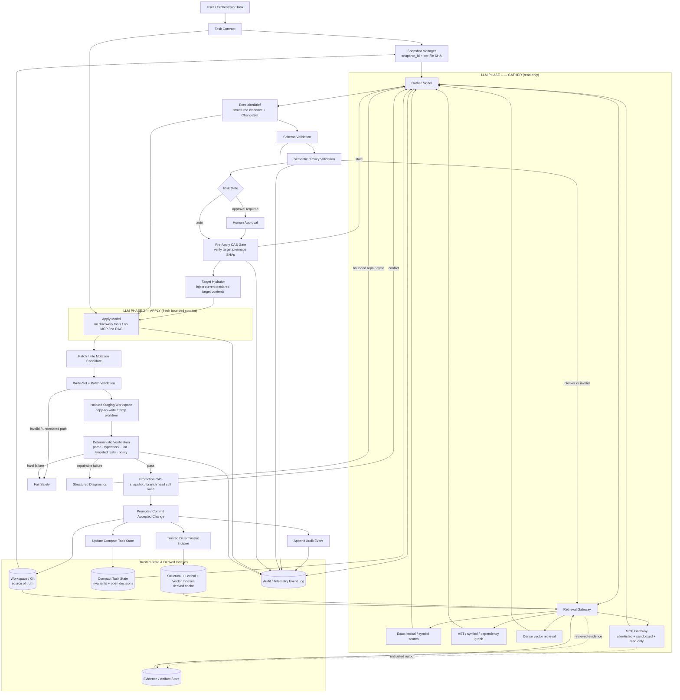

# Senior AI Architecture Review and Recommended Design

**Scope:** Local/open-weight LLM software-engineering agent loop, repository-scale context management, hybrid retrieval, MCP integration, mutation safety, and evaluation.

**Documents reviewed:**  
`01-loop-redesign.md`, `architecture_flow.md`, `copilot_architecture.md`, `deepseek-review.md`, `Final_gemini_Review.md`, `Final_gemini_Review_v1.md`, `Loop_agent_discussion.md`, `Loop_agent_discussion_RAG.md`, and `requirement.md`.

**Review stance:** The documents are treated as competing design inputs. Consensus is not automatically accepted, and critic recommendations are not automatically adopted. The architecture below preserves the strongest idea in the original proposal—the Gather/Apply context boundary—but changes several hardening mechanisms where the critiques introduce unnecessary coupling, serialization, or false security.

---

## 1. Executive decision

The project should proceed with a **two-LLM-phase architecture embedded in a deterministic transactional execution pipeline**:

1. **Gather** is an ephemeral, read-only reasoning phase used for repository exploration and planning.
2. A strict, machine-validated **ExecutionBrief** is the only semantic handoff from Gather to Apply.
3. The orchestrator performs **just-in-time target hydration** and optimistic concurrency checks immediately before Apply.
4. **Apply** receives a fresh bounded context and has mutation capability only for declared targets. It has **no general repository discovery, RAG, or MCP access**.
5. Candidate changes are written to an **isolated staging workspace**, not directly to the live workspace.
6. Deterministic verification runs outside the LLM: syntax/parse, type checking, linting, targeted tests, write-set enforcement, and policy checks.
7. Only a verified change is promoted, using a final compare-and-swap (CAS) check against the expected repository state.
8. Context indexes are updated by a **trusted deterministic indexer**, never by the Gather model or a third-party MCP tool.
9. MCP servers are treated as potentially hostile processes. “Read-only” is enforced by **client policy + OS/container sandboxing + least privilege**, not by trusting MCP annotations.
10. Performance budgets are **hardware/model profiles and empirical SLOs**, not universal constants.

This retains the original architecture's main benefit—discarding the expensive Gather transcript before editing—while strengthening correctness and reducing the need for global locks or rollback-after-damage.

---

## 2. What the source documents establish

### 2.1 Strong evidence for the Gather/Apply split

The original redesign contains the strongest project-specific evidence: three measured runs used roughly **177k–373k input tokens** for **18k–35k output tokens**, with approximately **30 reads per write**. The document correctly identifies the main mechanism: research and mutation share one growing message history, so each subsequent step repeatedly carries prior tool output.

That diagnosis is directionally strong. The architecture should preserve:

- a phase boundary rather than another behavioral prompt;
- an ephemeral Gather transcript;
- a compact structured handoff;
- a fresh Apply context;
- explicit total-node budgets;
- truncation/error recovery;
- measurement before removing legacy guards.

One wording should be tightened: the **cumulative amount of retransmitted history** can grow approximately quadratically with step count when history itself grows roughly linearly and the whole transcript is resent at each step. That is separate from the attention complexity of an individual model invocation.

### 2.2 The critics correctly identify missing integrity controls

The critical review is right about several production gaps:

- a stale target can invalidate a Gather plan;
- partial mutation requires a transaction strategy;
- syntactically valid structured output can still be semantically wrong;
- a task blackboard cannot grow without bound;
- multi-file edits need ordering/dependency semantics when dependencies actually exist;
- observability is mandatory if the redesign is supposed to be empirically validated.

However, two proposed remedies should **not** be adopted literally:

- giving Apply a general model-driven `read_file` tool;
- acquiring and holding a global epoch lock across Gather.

Both solve real problems but at a higher architectural cost than necessary.

---

## 3. Decision matrix: where the documents disagree

| Topic | Source proposals | Senior decision | Rationale |
|---|---|---|---|
| Gather/Apply split | Strong agreement | **Accept** | Removes research transcript from mutation context and gives a clean capability boundary. |
| Apply can read | Original: no reads; critics: scoped `read_file` | **Modify** | Apply sees current declared targets through orchestrator hydration, but gets no general discovery tool. |
| Epoch locking | Critics: lock epoch during execution | **Reject as default** | Long Gather locks serialize writers and waste concurrency. Use snapshot + per-file SHA + CAS/retry instead. |
| Epoch counter | Used as primary freshness gate | **Keep, but demote** | Useful for cache/index invalidation and telemetry; per-file content hashes are the stronger mutation precondition. |
| Rollback journal | Critics: rollback after partial writes | **Modify** | Primary safety is isolated staging + verify-before-promotion. Journal remains useful for audit/debugging. |
| Semantic validation | Critics add fourth validation stage | **Accept** | Schema validity is not semantic validity. |
| Markdown fallback | Three-stage fallback accepts extracted Markdown | **Restrict** | Syntax repair is acceptable; ambiguous semantic coercion is not. Retry once, then fail safe. |
| 7.5–8k chunks | Used as context/index unit | **Modify** | Separate storage/context packs from retrieval units. Retrieval should be symbol-/region-sized and structurally aware. |
| Hybrid RAG | Dense + lexical | **Accept and extend** | Add AST/symbol/dependency graph retrieval and diversity/reranking. |
| RAG quality field | Average relevance score suggested | **Replace** | Embedding score is not confidence. Track coverage, exact hits, retriever agreement, freshness, and eval metrics. |
| Task blackboard | Append summaries indefinitely | **Reject append-only prompt state** | Keep a bounded compact state; move history to append-only audit log outside prompts. |
| MCP “forced pure” | Tool metadata rewritten/forced to pure | **Reject as security mechanism** | Remote annotations are not a trust boundary; enforce OS/client capability restrictions. |
| MCP namespacing | `mcp__<server name>__<tool>` | **Modify** | Use a configured unique server ID, not server-reported name alone. |
| Gather updates context index through MCP | Proposed in discussion | **Reject** | Violates Gather read-only invariant. Index maintenance is trusted infrastructure. |
| Fixed token/TTFT targets | 24k Gather, 2k brief, 3–6k Apply, TTFT <1.5s | **Treat as initial profile only** | Hardware, model, tokenizer, repo, and task class change the optimum. |
| Human approval | Suggested for sensitive changes | **Accept risk-based** | Use policy triggers, not approval on every node. |
| Guard removal | Remove after two-phase benchmark | **Accept** | Preserve guard coverage until A/B evidence shows it is redundant. |

---

## 4. Recommended architecture

### 4.1 Architectural layers

#### A. Source-of-truth layer

The **workspace/Git snapshot is authoritative**.

Derived data must never outrank it:

- structural index;
- lexical index;
- vector embeddings;
- module summaries;
- context packs;
- Task State summaries.

Every derived record carries enough provenance to detect staleness:

- path;
- source snapshot/commit identifier;
- file content SHA;
- byte or line range;
- index version;
- optional symbol ID.

The existing global epoch can remain, but it is a **coarse invalidation generation**, not the only concurrency key.

#### B. Trusted indexer

A trusted deterministic service builds and updates:

- file manifest;
- symbol table;
- definitions/references;
- import/dependency edges;
- lexical search corpus;
- vector retrieval units;
- optional module/context summaries.

**Important correction:** Gather never calls `writeChunks`, `rechunk`, or any index-write tool. Index updates occur after accepted workspace changes or on explicit trusted maintenance events.

This preserves the rule that Gather is logically read-only.

#### C. Gather

Gather receives:

- Task Contract;
- compact Task State;
- snapshot ID;
- small repository map / relevant recent deltas;
- read-only Retrieval Gateway.

Gather may access:

1. exact lexical/symbol search;
2. AST/symbol index;
3. dependency/reference graph;
4. dense vector retrieval;
5. bounded direct file-region reads;
6. approved read-only MCP tools;
7. artifact/evidence reads.

Gather may **not** mutate:

- workspace files;
- task state;
- indexes;
- Git;
- artifacts except via trusted logging/spill infrastructure controlled by the orchestrator.

Its output is an `ExecutionBrief`.

#### D. Handoff validator

The handoff pipeline should be:

1. constrained/schema generation where supported;
2. deterministic JSON syntax repair only when unambiguous;
3. schema validation;
4. semantic validation;
5. policy/risk validation;
6. one bounded correction attempt with explicit validation errors;
7. fail safely if still invalid.

Do not silently convert unconstrained prose into a mutation plan and proceed.

#### E. Pre-Apply hydration and CAS

Immediately before Apply:

1. verify each target path still matches the `preimage_sha` expected by the brief;
2. obtain the **current contents of only declared target files/regions**;
3. inject those contents into the fresh Apply prompt.

This solves “blind mutation” without exposing a model-driven repository read capability.

If a target changed:

- no write is attempted;
- stale targets are identified;
- revalidate or re-Gather only the affected scope.

#### F. Apply

Apply receives:

- Task Contract;
- validated ExecutionBrief;
- compact relevant invariants;
- current declared target contents;
- output-format/edit constraints.

Apply has no:

- RAG;
- vector DB;
- MCP;
- broad grep;
- unrestricted `read_file`;
- index navigation.

Apply outputs a candidate patch or replacement content for **declared targets only**.

For very large target files, use one of two modes:

- inject the complete file if within the Apply budget;
- inject a deterministic edit frame containing the planned region plus structural anchors and enough surrounding context.

The latter is still orchestrator hydration, not open-ended discovery.

#### G. Staging mutation transaction

Do not mutate the live workspace as each LLM operation arrives.

Create a staging environment, for example:

- temporary Git worktree;
- copy-on-write overlay;
- temporary index/tree;
- equivalent isolated workspace.

Then:

1. validate patch applicability/preimages;
2. apply all candidate changes to staging;
3. reject undeclared paths;
4. preserve an audit journal;
5. leave the live workspace untouched until verification passes.

A mutation journal is therefore **secondary**: useful for audit and diagnostics, but the architecture should avoid needing rollback for most failures.

#### H. Deterministic verification

Verification is not an LLM phase.

Run an ordered policy such as:

1. write-set/path policy;
2. parse/syntax checks;
3. formatter if policy allows deterministic formatting;
4. static/type checks;
5. lint;
6. targeted unit tests;
7. affected integration tests;
8. repository-specific gates;
9. secret/security policy;
10. diff sanity limits.

The validator returns structured diagnostics.

A repair cycle is allowed only under a separate budget:

`diagnostics -> Gather repair -> new ExecutionBrief -> Apply -> staged verify`

Set a strict maximum number of repair cycles.

#### I. Promotion

After staging passes:

1. perform a final snapshot/branch-head or file-SHA CAS;
2. if live state changed, do not overwrite it;
3. re-Gather/rebase through a controlled path;
4. otherwise promote/commit;
5. emit an audit event;
6. update compact task state;
7. trigger trusted indexing.

---

## 5. Recommended ExecutionBrief

The existing `NodeBrief` is a good first abstraction, but the production handoff should carry explicit preconditions, dependency semantics, validation intent, and evidence references.

```ts
interface ExecutionBrief {
  version: 1;
  task_id: string;
  snapshot_id: string;
  objective: string;

  evidence: {
    id: string;
    source: "workspace" | "index" | "mcp" | "artifact";
    path_or_uri: string;
    reason: string;
    sha?: string;
    start_line?: number;
    end_line?: number;
    trust: "trusted-workspace" | "derived" | "external-untrusted";
  }[];

  changes: {
    id: string;
    path: string;
    operation: "create" | "modify" | "delete";
    intent: string;
    preimage_sha?: string;
    evidence_ids: string[];
    depends_on: string[];
  }[];

  invariants: string[];

  validation: {
    required_checks: string[];
    suggested_commands: string[];
  };

  blockers: {
    code: string;
    message: string;
    needs?: string[];
  }[];

  risk: {
    level: "low" | "medium" | "high";
    reasons: string[];
  };
}
```

### Why this schema is stronger

- `snapshot_id` anchors the reasoning state.
- `preimage_sha` makes stale writes mechanically rejectable.
- evidence is referenced rather than blindly duplicating large snippets.
- `depends_on` supports multi-file sequencing without requiring every plan to become a complex DAG.
- validation intent is decided before mutation.
- risk is explicit and can drive a human gate.
- trust labels distinguish workspace facts from third-party MCP data.

---

## 6. RAG and repository context: recommended redesign

### 6.1 Do not use one chunk size for every job

The documents use approximately 7.5–8k-token Markdown chunks as the principal repository context unit. That is useful as a **storage/context-pack abstraction**, but it is too coarse as the main retrieval unit.

Use four levels instead:

| Level | Purpose | Typical unit |
|---|---|---|
| Repository map | Cheap navigation | file/module/symbol summaries |
| Structural index | Dependency reasoning | symbols, definitions, refs, imports, callers |
| Retrieval unit | Search | function/class/block or ~200–800 token semantic region |
| Prompt evidence | LLM consumption | ~150–400 token focused excerpt, adaptive |

Large context packs may still exist for cold-start summaries or artifact spill, but dense retrieval should not be forced to retrieve 8k-token blocks.

### 6.2 Retrieval pipeline

Recommended ranking flow:

1. extract exact identifiers, paths, errors, APIs from the task;
2. lexical/symbol retrieval;
3. AST/reference/dependency expansion;
4. dense semantic retrieval;
5. fuse candidates;
6. rerank;
7. diversity/coverage selection;
8. fetch focused line regions;
9. verify source SHA freshness;
10. stop when evidence coverage is sufficient or budget is reached.

### 6.3 Retrieval confidence is not an embedding average

Do not use a field such as `avg_relevance_score = 0.87` as a decision signal without calibration.

Prefer observable signals:

- exact symbol/path hit;
- target-definition coverage;
- caller/callee/import coverage;
- agreement between lexical, graph, and vector retrieval;
- reranker margin;
- evidence freshness;
- number of unresolved plan assumptions;
- whether the model requested a source it could not retrieve.

Offline, measure:

- Recall@K;
- MRR / nDCG where useful;
- line-level coverage;
- context efficiency (useful lines / lines supplied);
- retrieval-to-resolved-task correlation.

At runtime, if evidence is inadequate, permit one or two bounded query reformulations; then return a blocker.

### 6.4 Keep external evidence out of the authority chain

MCP/RAG content from external sources remains untrusted evidence.

For changes involving:

- authentication;
- authorization;
- secrets;
- migrations;
- build/release policy;
- dependency security;

require the relevant claim to be verified against an approved authoritative source or local workspace state before it becomes an implementation invariant.

---

## 7. MCP security architecture

This is where the source documents require the largest correction.

### 7.1 Do not “force” a third-party MCP tool to be pure by relabeling it

The client can label a tool internally, but that does **not** make the server process side-effect free.

The policy should be based on:

- configured server identity;
- explicit tool allowlist;
- administrator/user-approved capability manifest;
- sandbox policy;
- filesystem mounts;
- network policy;
- credentials/scopes;
- transport policy;
- observed audit behavior.

MCP tool annotations are hints, not an enforcement boundary.

### 7.2 Use a stable client-configured server ID

Namespace tools as:

`mcp__<configured_server_id>__<tool_name>`

Do not rely solely on a server-reported name to guarantee uniqueness.

### 7.3 Sandbox local MCP servers

Default Gather MCP sandbox:

- no workspace write mount;
- only explicitly approved read paths;
- no home-directory access;
- no SSH/keychain/token directories;
- network disabled unless the server requires an approved destination;
- minimal environment variables;
- dedicated credentials;
- least-privilege OAuth scopes;
- execution timeout and output cap;
- stdout/stderr/audit capture;
- explicit install/configuration consent.

If a server genuinely requires mutation, it belongs in a separate privileged workflow—not the normal Gather tool set.

---

## 8. Concurrency and state model

### 8.1 Why a global epoch lock is not the default

A Gather phase can be relatively long. Holding an exclusive workspace epoch lock for the whole phase would:

- serialize otherwise independent nodes;
- block external developer changes;
- turn model latency into lock latency;
- reduce parallelism;
- create lock expiry/recovery complexity.

Use optimistic concurrency instead.

### 8.2 Recommended model

At Gather start:

- capture `snapshot_id`;
- capture relevant file SHAs.

Before Apply:

- verify target preimages;
- hydrate current targets.

Before promotion:

- verify branch/snapshot/file preconditions again.

On mismatch:

- reject stale mutation;
- revalidate/re-Gather.

This is analogous to snapshot-based concurrency control: readers reason over a stable observed state, but stale writers must fail rather than overwrite newer data.

### 8.3 When locking is still appropriate

Short locks are reasonable for:

- final promotion;
- updating a shared manifest;
- atomic task-state replacement;
- index metadata swap.

Locks should protect small deterministic critical sections, not model inference.

---

## 9. Task State redesign

Do not pass an endlessly appended `task_state.json` into every prompt.

Split state into:

### Prompt-visible compact Task State

Contains only:

- current objective;
- active invariants;
- accepted architectural decisions;
- unresolved blockers;
- relevant completed-node summaries;
- current snapshot/epoch;
- current risk/policy flags.

Enforce a token/byte cap.

### Append-only audit/event log

Contains:

- every Node/ExecutionBrief;
- retrieval queries and selected evidence IDs;
- tool calls;
- validation results;
- patch hashes;
- repair attempts;
- state transitions;
- model/provider/version;
- token and latency telemetry.

This can grow because it is **not automatically injected into prompts**. Retrieve from it only when needed.

### Summaries

Older state is compacted into versioned summaries with source event IDs. A summary is a cache, not the sole historical record.

---

## 10. Capability matrix

| Capability | Gather | Apply | Validator / Infra |
|---|---:|---:|---:|
| Read Task Contract | Yes | Yes | Yes |
| Read compact Task State | Yes | Selected invariants | Yes |
| Lexical/grep search | Yes | No | Optional |
| AST/symbol graph | Yes | No | Yes |
| Vector retrieval | Yes | No | Yes |
| Workspace region read | Yes | No general tool | Yes |
| Current target hydration | Via orchestrator | Injected input | Yes |
| MCP | Allowlisted, sandboxed | **No** | Admin/integration only |
| Write source files | No | Candidate only | Staging/promotion |
| Write context/index | No | No | **Trusted indexer only** |
| Run tests | No, except read-only diagnostics if explicitly permitted | No | **Yes** |
| Change Git refs | No | No | Promotion service only |
| Update Task State | No | No | State manager only |

This makes the LLMs consumers/producers of bounded semantic data while deterministic infrastructure owns side effects.

---

## 11. Data-flow diagram



A standalone Mermaid version and rendered SVG are provided alongside this document.

---

## 12. Failure handling

| Failure | Correct behavior |
|---|---|
| Gather cannot find enough evidence | Emit blocker; no Apply |
| Structured handoff malformed | Syntax repair if deterministic; otherwise retry once and fail |
| Semantic validation fails | Feed exact validation error to bounded Gather correction |
| Target SHA changed before Apply | Reject; re-Gather/revalidate affected scope |
| Apply references undeclared path | Reject candidate before staging |
| Patch cannot apply cleanly | Reject in staging; live workspace unchanged |
| Parse/type/lint/test fails | Structured diagnostics -> bounded repair cycle or fail |
| Live branch changes before promotion | CAS fail; no overwrite; re-Gather/rebase |
| MCP timeout | Degrade gracefully if nonessential; otherwise blocker |
| MCP output huge | Spill to artifact; pass a bounded summary/reference |
| MCP tries disallowed access | Sandbox/policy denies; security event |
| Index is stale | Read source of truth directly; queue trusted reindex |
| Repair budget exhausted | Fail with artifacts/diagnostics for human review |

---

## 13. Evaluation and rollout gates

The existing documents correctly insist on measurement before deleting the old guards. Keep that principle, but change the metrics from fixed universal numbers to a benchmark profile.

### 13.1 Compare four configurations

Run the same representative task set under:

1. legacy single-phase loop;
2. two-phase loop without RAG;
3. two-phase + lexical/structural retrieval;
4. two-phase + lexical/structural + dense retrieval.

Do not assume dense RAG wins.

### 13.2 Core metrics

#### Correctness

- resolved-task rate;
- patch acceptance rate;
- first-pass verification rate;
- regression rate;
- undeclared-write count;
- stale-preimage rejection rate;
- repair-cycle success rate.

#### Context/retrieval

- input tokens per successful task;
- input tokens per node;
- Gather tokens;
- Apply tokens;
- line-level evidence recall/coverage;
- context efficiency;
- irrelevant evidence rate;
- re-Gather rate.

#### Latency

- P50/P95 task latency;
- P50/P95 TTFT by model/hardware profile;
- Gather duration;
- Apply duration;
- verification duration;
- index-update lag.

#### Safety

- attempted undeclared writes;
- staging isolation failures;
- MCP sandbox denials;
- unauthorized network/filesystem access attempts;
- promotion CAS conflicts;
- human-gate rate.

### 13.3 Suggested initial promotion criteria

Treat these as starting thresholds, not universal architecture requirements:

- **≥60–75% median reduction** in input tokens per successful task versus the legacy baseline;
- no statistically meaningful resolved-rate regression beyond the project’s agreed tolerance;
- **100% rejection** of intentionally stale target preimages in concurrency tests;
- **0 live-workspace modifications** when staged verification fails;
- **0 undeclared writes** in adversarial write-set tests;
- Apply context stays within its configured model profile at P95;
- RAG must beat structural+lexical retrieval on end-to-end outcomes before it becomes mandatory;
- MCP sandbox tests must demonstrate denied access outside configured capability boundaries.

The existing `<1.5 s TTFT` target should only be used when the exact GPU, quantization, serving engine, model, and prompt size are specified.

---

## 14. Guard migration strategy

Do not delete guards because the new design “should” make them obsolete.

### Stage 0 — Instrument current loop

Capture baseline telemetry on the exact task corpus.

### Stage 1 — Two-phase behind feature flag

Implement:

- ExecutionBrief;
- fresh Apply session;
- target hydration;
- existing write-set gates retained.

### Stage 2 — Transactional mutation

Add:

- per-target SHA preconditions;
- isolated staging;
- deterministic verification;
- final promotion CAS.

### Stage 3 — Trusted repository intelligence

Add:

- structural index;
- symbol/reference graph;
- lexical search;
- compact task state.

### Stage 4 — Hybrid dense retrieval

Only after structural/lexical baseline exists, add embeddings and reranking. Compare A/B.

### Stage 5 — MCP

Add the sandboxed MCP gateway only after:

- capability policy exists;
- audit logging exists;
- deny-by-default permissions exist;
- security tests pass.

### Stage 6 — Guard deprecation

Remove a legacy guard only when telemetry demonstrates the new architectural boundary subsumes its failure mode.

Keep global task ceilings and provider truncation handling unless separate evidence says they are unnecessary.

---

## 15. Implementation priority

### P0 — Correctness boundary

- Gather/Apply session split;
- ExecutionBrief schema;
- schema + semantic validation;
- target hydration;
- per-target SHA/CAS;
- write-set enforcement;
- staging workspace;
- deterministic verification;
- telemetry.

### P1 — Repository intelligence

- source manifest;
- AST/symbol index;
- dependency/reference graph;
- lexical retrieval;
- compact Task State + event log split;
- trusted incremental indexer.

### P2 — Retrieval optimization

- dense vector retrieval;
- fusion/reranking;
- retrieval evaluation harness;
- evidence coverage metrics;
- adaptive budgets.

### P3 — MCP

- configured unique server IDs;
- allowlists;
- sandbox;
- least-privilege credentials;
- consent;
- spill/timeout/audit;
- red-team tests.

### P4 — Advanced optimization

- specialized Gather/Apply models;
- edit-format routing (patch vs region rewrite vs whole-file rewrite);
- parallel Gather across independent subproblems;
- cached deterministic retrieval;
- learned retrieval/reranking if benchmark data justifies it.

---

## 16. Points I would explicitly remove from the current synthesized requirements

The following should **not** be normative production requirements:

1. “Apply has `read_file` but only three calls.”  
   Replace with deterministic just-in-time target hydration.

2. “Acquire an epoch lock before Gather.”  
   Replace with optimistic snapshots + per-file hashes + short promotion locks.

3. “Every MCP tool is forced to `pure`/`t0`.”  
   Replace with external policy and sandbox enforcement. Metadata alone cannot guarantee behavior.

4. “Gather MCP tools write/rechunk the index.”  
   Remove from the model-facing surface entirely.

5. “7.5–8k is the retrieval chunk size.”  
   Keep large context packs if useful, but retrieve symbol/region-sized units.

6. “Markdown extraction is an accepted semantic fallback for a mutation plan.”  
   Do not silently coerce ambiguous prose into executable changes.

7. “TTFT <1.5s is an architecture acceptance criterion.”  
   Make it a hardware/model-specific SLO.

8. “Average vector relevance score is a reliable RAG quality gate.”  
   Use retrieval coverage and benchmarked/calibrated signals.

---

## 17. Research alignment

The recommended design is consistent with several external findings:

- **SWE-Edit (2026)** identifies context coupling between code viewing/planning/editing and reports gains from separating viewer/editor contexts.
- **SWE-Explore (2026)** isolates repository exploration and finds line-level coverage, ranking, and context efficiency strongly associated with downstream repair behavior.
- **AutoCodeRover** demonstrates the value of AST/program-structure-guided iterative search rather than treating a repository as only a bag of files.
- **RepoGraph** reports gains from repository-level structural graphs across multiple software-engineering systems.
- **RAG-for-code empirical work (2025)** finds that contextual code and API evidence can help while retrieved “similar code” can add material noise—supporting selective hybrid retrieval rather than indiscriminate vector context.
- **Long-context research** shows that merely providing a large context does not guarantee robust use of the relevant information.
- **Current MCP guidance** requires clients to treat tool annotations as untrusted unless they come from trusted servers and recommends sandboxing/least privilege for local servers.
- **Git/transactional systems guidance** supports validating expected preimages and performing short transactional promotion rather than letting a long-running reasoning phase own a global write lock.

---

## 18. Final architecture statement

The strongest version of this system is **not** “Gather reads, Apply writes.”

It is:

> **Gather discovers against a versioned snapshot; a validated brief declares exactly what may change; the orchestrator hydrates fresh target state; Apply generates only declared mutations in a clean context; deterministic infrastructure stages, verifies, and conditionally promotes them; all derived indexes and external tools remain outside the mutation authority boundary.**

That architecture preserves the original loop redesign's efficiency thesis while resolving the critics' legitimate concerns without turning Apply back into a research agent or serializing the entire workspace behind a long-lived lock.

---

## 19. Source-review map

| Document | Most useful contribution | Main issue/limitation |
|---|---|---|
| `01-loop-redesign.md` | Empirical baseline; root-cause diagnosis; clean phase boundary; staged measurement | Original Apply boundary lacks explicit transactional mutation design |
| `Loop_agent_discussion.md` | Context/index conventions and retrieval workflow | Contradiction: Gather is “read-only” but also writes/rechunks index through MCP |
| `Loop_agent_discussion_RAG.md` | Gather-only RAG, provenance, staleness checks, A/B validation | Still treats vector/snippet scores too directly as retrieval confidence |
| `Final_gemini_Review.md` | Consolidated blueprint and operational defaults | Converts several hypotheses/defaults into overly rigid architecture claims |
| `Final_gemini_Review_v1.md` | Expanded flow and state transformation | Inherits fixed chunk/budget assumptions |
| `copilot_architecture.md` | Requirement-level codification and telemetry gates | Internally says both “Apply no reads” and “target read at start”; needs capability clarification |
| `deepseek-review.md` | Correctly exposes stale mutation, rollback, semantic-validation, blackboard, telemetry gaps | Scoped model reads and long epoch locks are heavier than needed |
| `architecture_flow.md` | Makes critic hardening changes visible | Encodes the critic's global lock/scoped-read choices as if settled |
| `requirement.md` | Useful reconciliation of agreements/contentions | Treats several critic fixes as final instead of evaluating alternatives |

---

## 20. External research consulted

Primary/official sources used for the independent review:

- Model Context Protocol — Tools specification, protocol revision **2026-07-28**.
- Model Context Protocol — Security Best Practices, revision **2026-07-28**.
- Git official documentation — `git apply` and `git update-ref`.
- SQLite official documentation — transaction isolation.
- *SWE-Edit: Rethinking Code Editing for Efficient SWE-Agent* (arXiv:2604.26102, 2026).
- *SWE-Explore: Benchmarking How Coding Agents Explore Repositories* (arXiv:2606.07297, 2026).
- *AutoCodeRover: Autonomous Program Improvement* (arXiv:2404.05427).
- *RepoGraph: Enhancing AI Software Engineering with Repository-level Code Graph* (arXiv:2410.14684).
- *What to Retrieve for Effective Retrieval-Augmented Code Generation?* (arXiv:2503.20589).
- *Lost in the Middle: How Language Models Use Long Contexts* (arXiv:2307.03172).

